# 🌾 Smart Indian Farmer Assistant

> **AI-Powered Precision Agriculture Platform using MobileNetV2, XGBoost and Multimodal Large Language Models**


---

## 📖 Overview

Smart Indian Farmer Assistant is an end-to-end AI platform developed to assist farmers with crop planning, disease diagnosis, fertilizer recommendations, weather-based irrigation, agricultural market insights, and multilingual AI guidance.

The system combines:

- 🌿 **MobileNetV2** for plant disease detection.
- 🌾 **XGBoost** for crop and fertilizer recommendation.
- 🤖 **Google Gemini** for conversational farming assistance.
- 🌦️ Weather APIs for irrigation support.
- 🌍 Multilingual support (English, Hindi, Tamil).

---

## ✨ Features

- Crop Recommendation
- Plant Disease Detection
- Fertilizer Recommendation
- Weather Forecast & Irrigation Advice
- Agricultural Market Prices
- AI Farming Chat Assistant
- Profit & Loss Calculator
- Crop Calendar
- Government Schemes
- Smart Notifications
- User Authentication
- Multilingual Interface

---

## 🧠 AI Models

| Model | Purpose |
|-------|---------|
| MobileNetV2 | Plant Disease Detection |
| XGBoost | Crop Recommendation |
| XGBoost | Fertilizer Recommendation |
| Gemini AI | Conversational Farming Assistant |

---

## 🛠️ Technology Stack

### Frontend
- React
- Vite
- Tailwind CSS
- Axios
- i18next

### Backend
- Node.js
- Express.js
- MongoDB
- JWT Authentication

### Machine Learning
- TensorFlow
- Keras
- MobileNetV2
- XGBoost
- Scikit-learn
- SHAP
- Pandas
- NumPy

### DevOps
- Docker
- Docker Compose

---

## 🏗️ Project Structure

```text
Smart-Indian-Farmer-Assistant
│
├── backend/
├── frontend/
├── ml_services/
├── infra/
├── docs/
├── README.md
├── PROJECT_DOCUMENTATION.md
└── docker-compose.yml
```

---

## 📸 Screenshots

# 📸 Application Screenshots

## 🏠 Dashboard

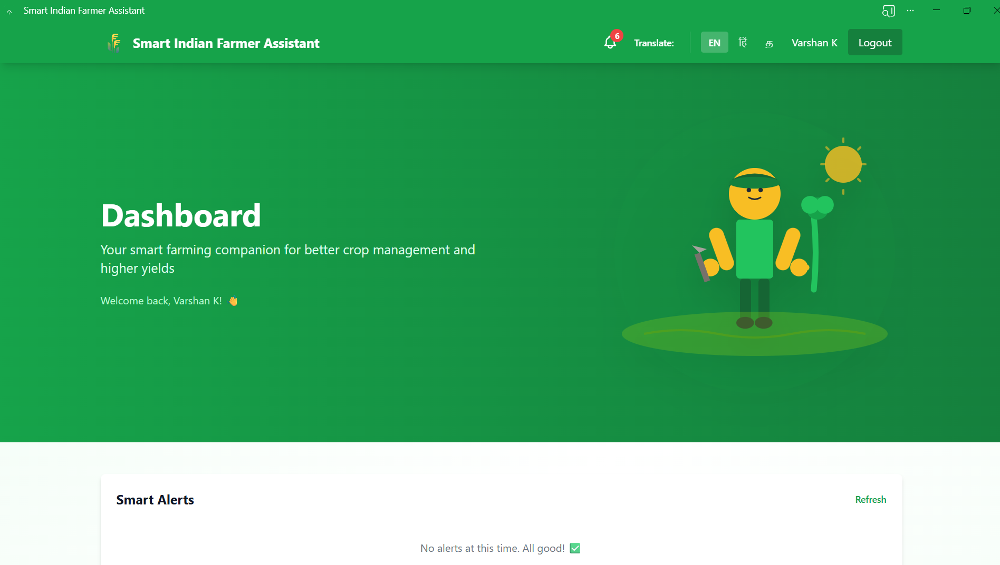

---

## 🏡 Home

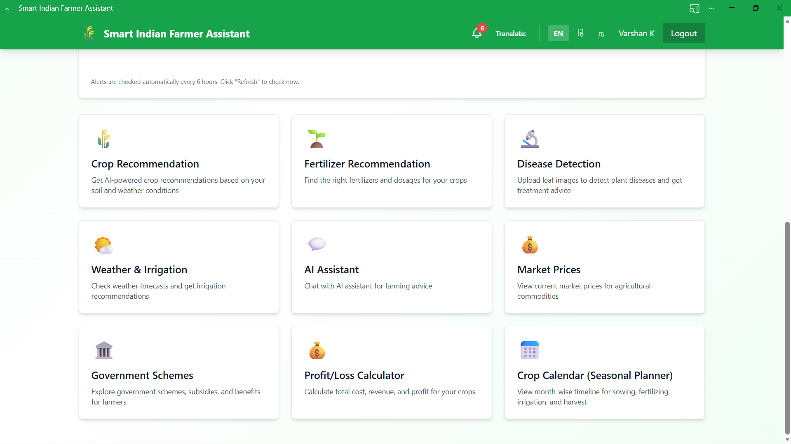

---

## 🤖 AI Farming Assistant

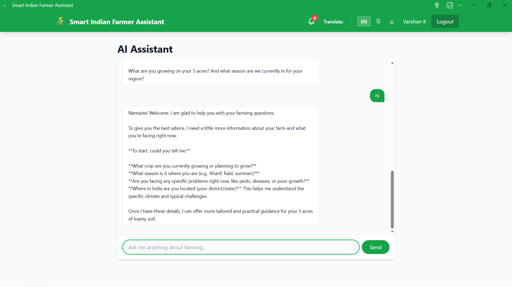

---

## 🌾 Crop Recommendation

### Input

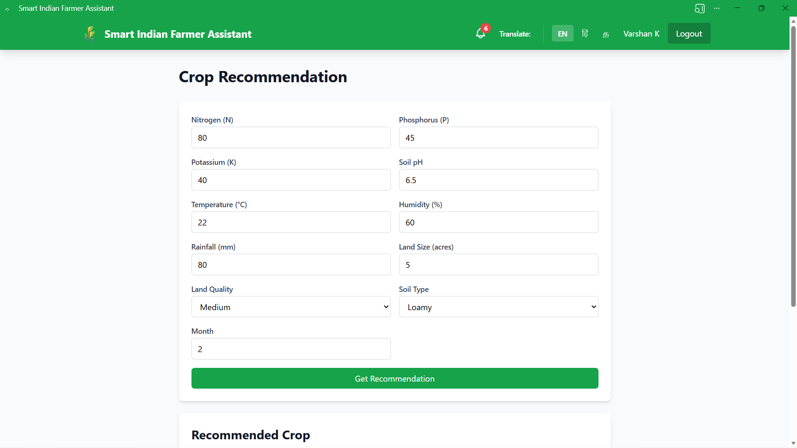

### Result

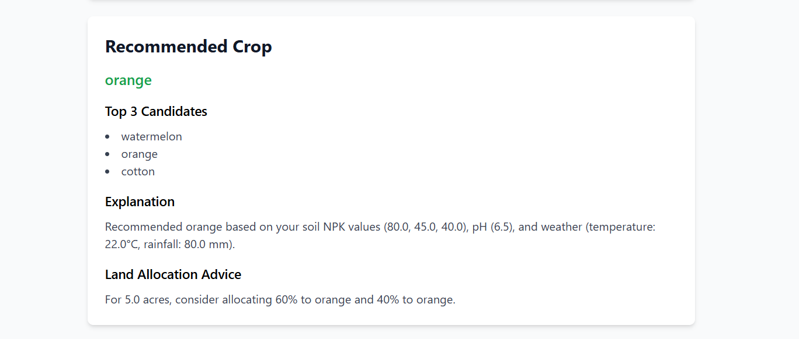

---

## 🌿 Plant Disease Detection

### Upload & Prediction

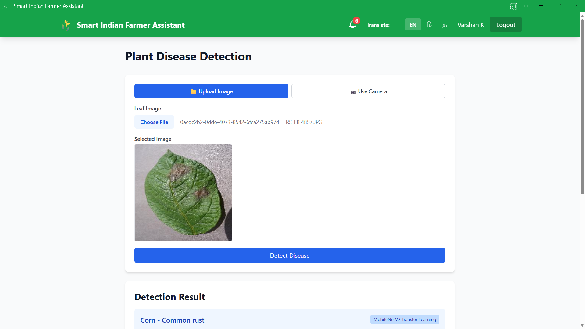

### Prediction Details

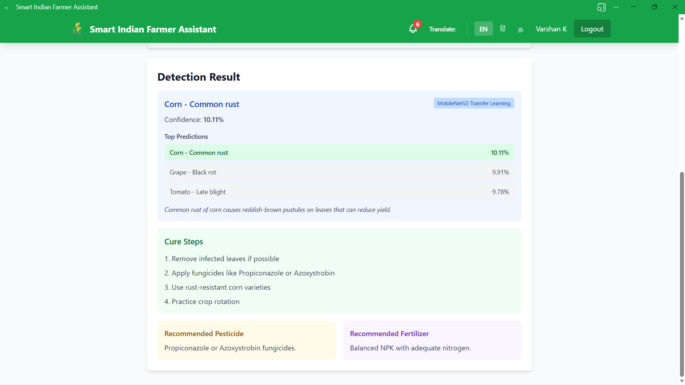

---

## 🌦️ Weather & Irrigation Dashboard

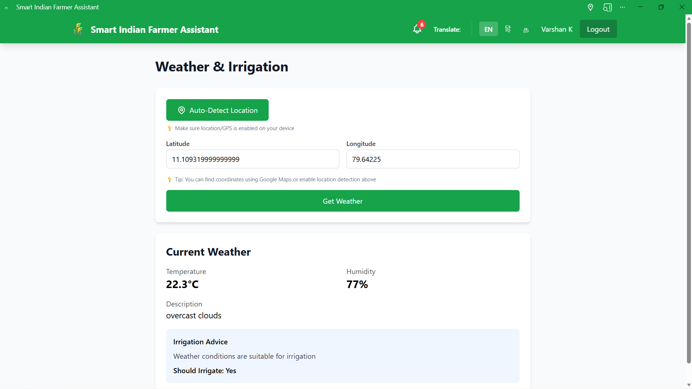

---

## 💹 Agricultural Market Prices

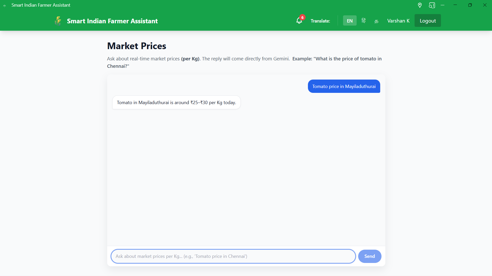

---

## 🏛️ Government Schemes

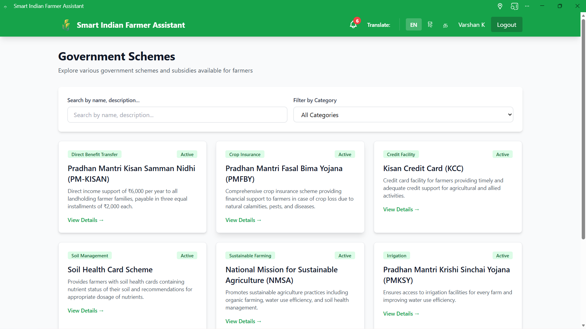

---

## 🔔 Smart Notifications

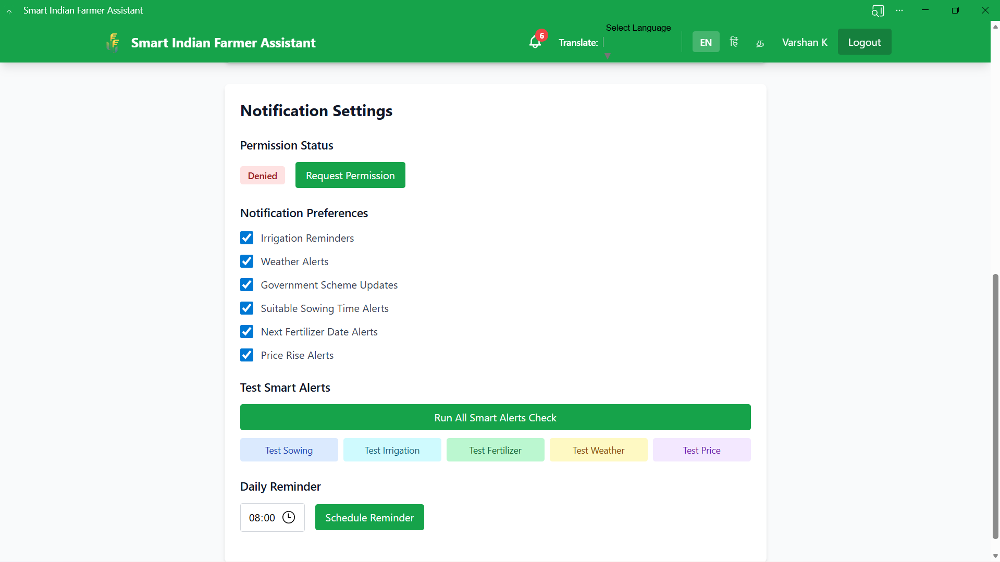

---

## 📅 Crop Calendar

### Overview

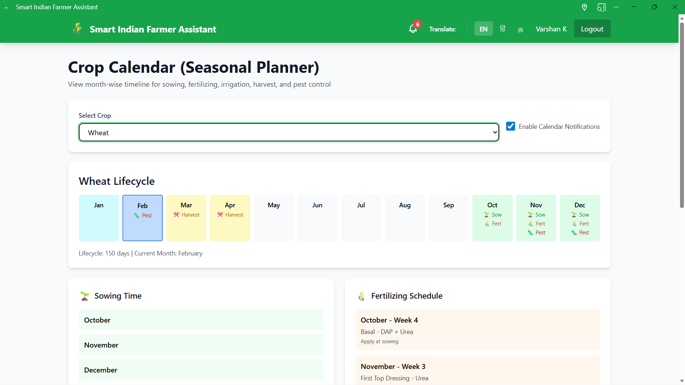

### Monthly Planner

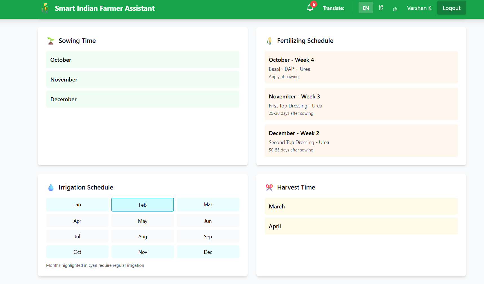

### Task Scheduler

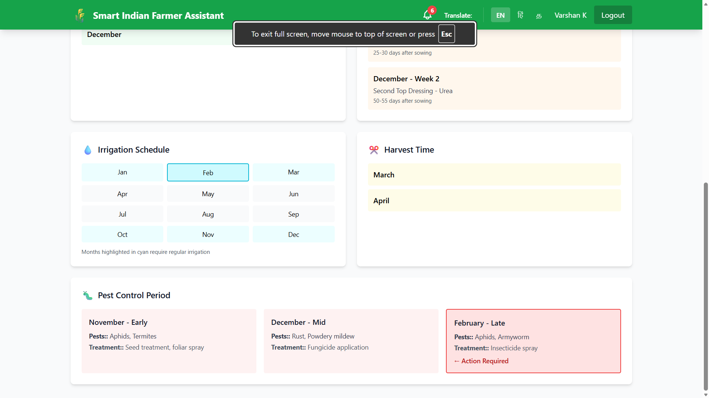

---

## 💰 Profit & Loss Calculator

### Input

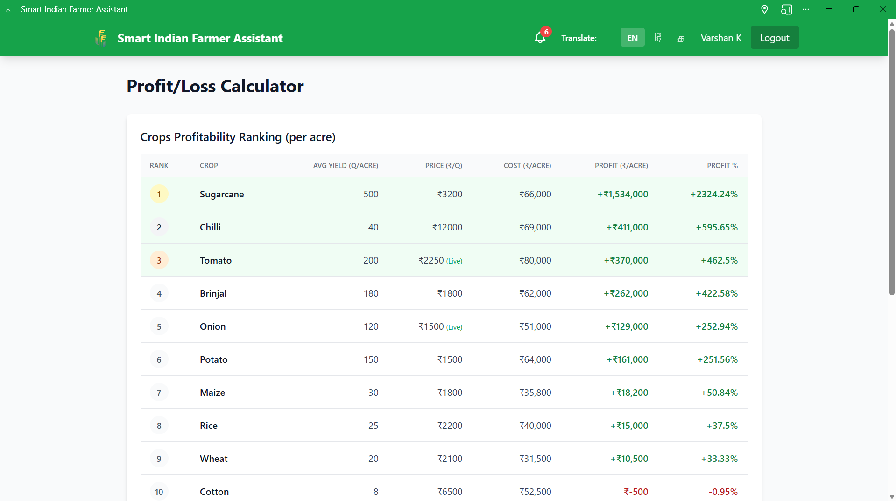

### Financial Summary

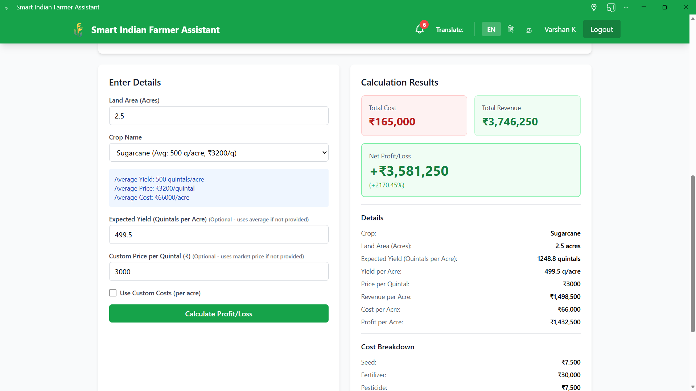

### Detailed Analysis

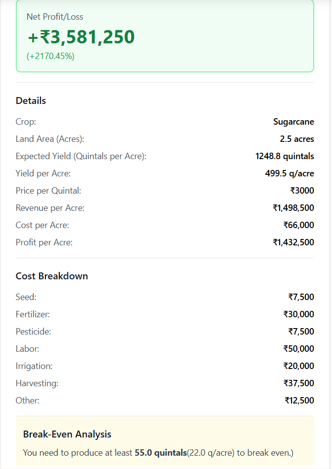

---

## 🌐 Multilingual Support

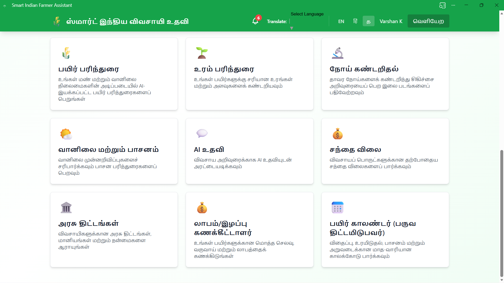

---

## 🚀 Installation

```bash
git clone https://github.com/Varshan222004/Smart-Indian-farmer-assistant.git
cd Smart-Indian-farmer-assistant
```

### Backend

```bash
cd backend
npm install
```

### Frontend

```bash
cd ../frontend
npm install
```

### ML Services

```bash
cd ../ml_services
pip install -r requirements.txt
```

### Run with Docker

```bash
docker-compose up
```

---

## 📚 APIs Used

- Google Gemini
- OpenWeatherMap
- OpenCage Geocoding
- Agmarknet

---

## 🏆 IEEE Publication

**Title**

**Smart Indian Farmer Assistant: A Tri-Modal AI Framework for Precision Agriculture Using MobileNetV2, XGBoost, and Multimodal Language Models**

**Conference**

IEEE International Conference on Emerging Trends in Advancements and Applications of Computational Intelligence Techniques (ETAACT 2026)

**DOI**

https://doi.org/10.1109/ETAACT69135.2026.11541876

---

## 📖 Citation

```bibtex
@inproceedings{varshan2026smart,
  title={Smart Indian Farmer Assistant: A Tri-Modal AI Framework for Precision Agriculture Using MobileNetV2, XGBoost, and Multimodal Language Models},
  author={Varshan K and others},
  booktitle={IEEE ETAACT 2026},
  year={2026},
  doi={10.1109/ETAACT69135.2026.11541876}
}
```

---

## 🛣️ Future Roadmap

- Mobile Application
- Drone Integration
- Satellite Image Analysis
- IoT Sensors
- Offline AI
- Voice Assistant
- Regional Language Expansion

---

## 👨‍💻 Author

**Varshan K**

B.Tech Computer Science and Engineering

GitHub: https://github.com/Varshan222004

---

## ⭐ Support

If you like this project, consider giving it a ⭐ on GitHub.
